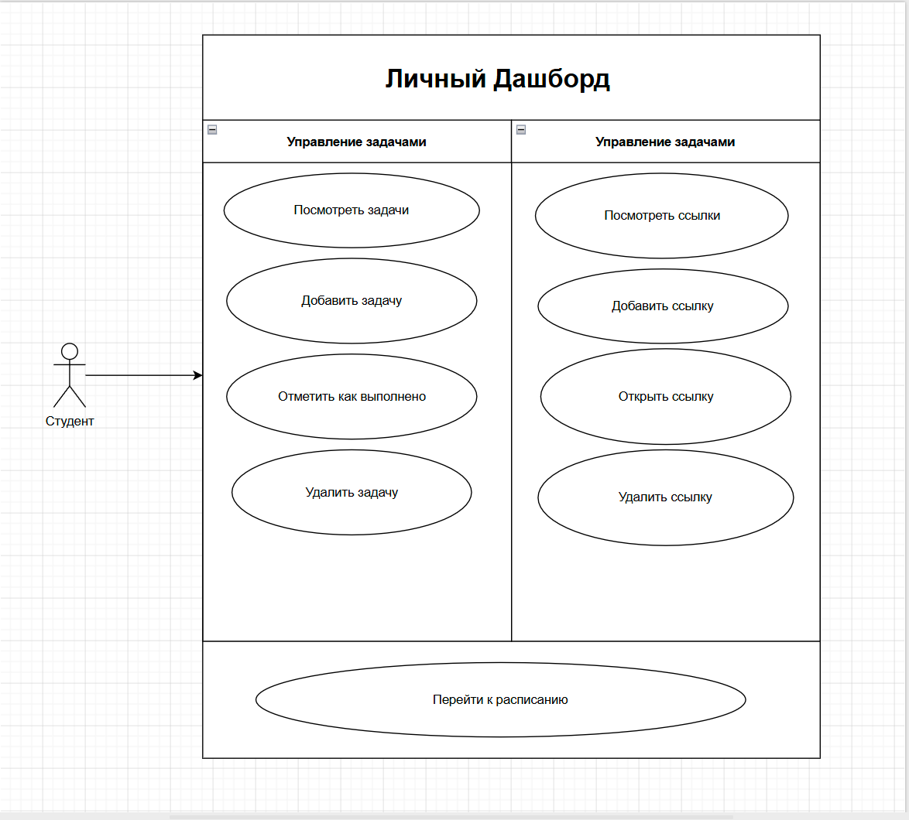
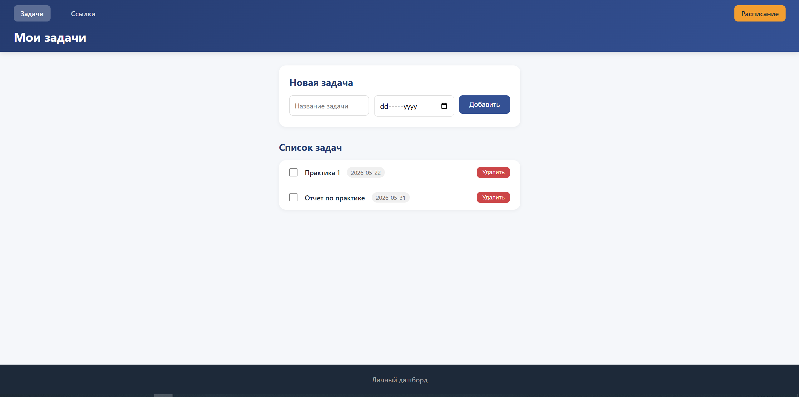
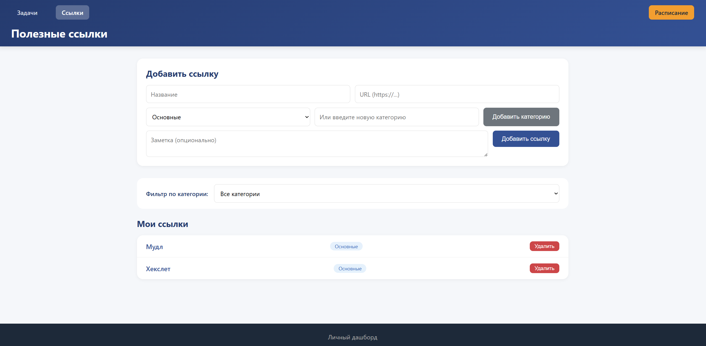

# Личный дашборд

Практика. Личный дашборд для помощи с организацией учебного процесса.

## Документация

[Описание проекта](./docs/description.md)

## Use-case диаграмма

## Прототип интерфейса

## УП.11. Задание

